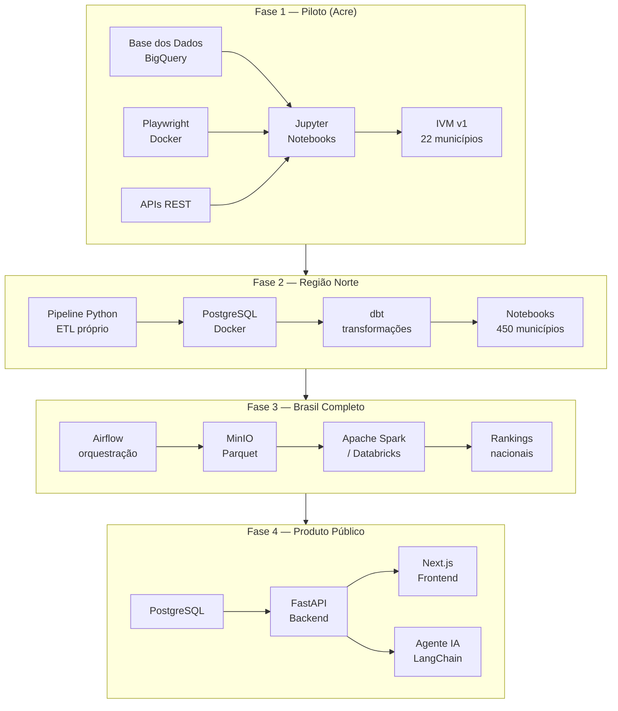
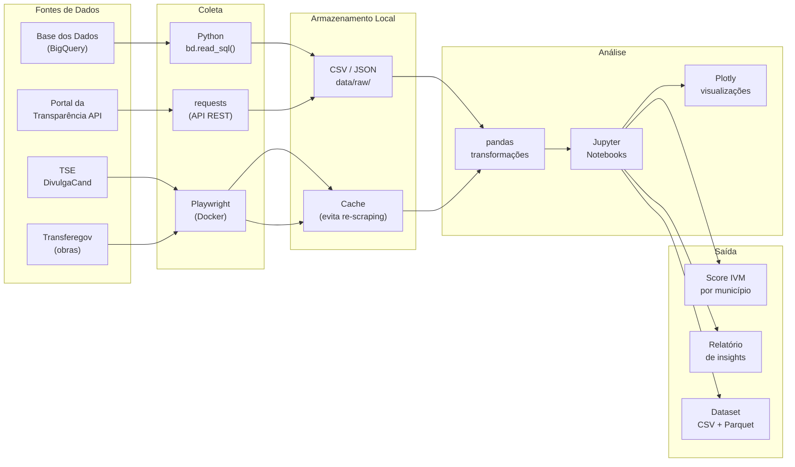
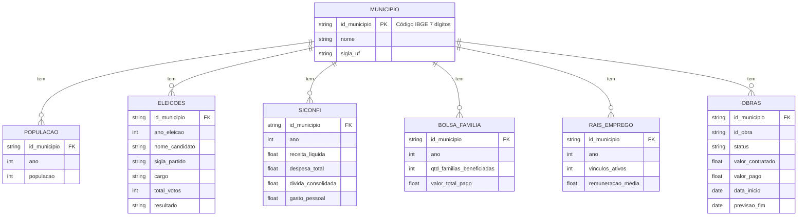
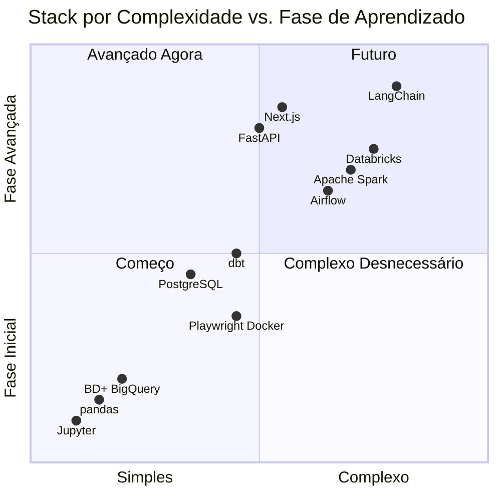

# Arquitetura Geral do Projeto

> Como os dados fluem desde os portais públicos até as análises e o produto final.

---

## Visão Macro — 4 Fases

---

## Fluxo de Dados — Fase 1 em Detalhe

---

## Chave de Cruzamento Universal

---

## Decisão de Stack por Fase

