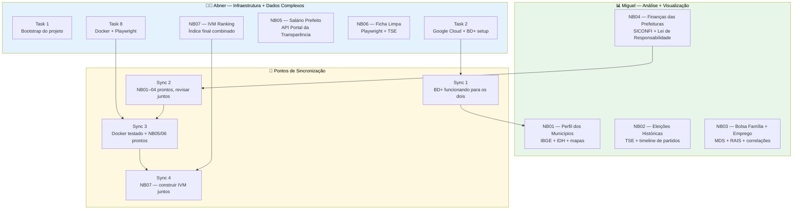

# Divisão de Tarefas — Abner + Miguel

> Cada um tem uma frente clara de trabalho. O objetivo é que ninguém fique bloqueado
> esperando o outro e que ambos aprendam as duas dimensões do projeto: infraestrutura
> e análise.

---

## Visão Geral

---

## Regras de Colaboração

1. **Commits frequentes** — commitar ao final de cada notebook ou task, não acumular
2. **Nunca commitar na branch do outro** sem combinar
3. **Cache obrigatório** — todo Playwright usa `data/raw/` com cache antes de rodar
4. **Nos Syncs** — um apresenta para o outro, explicando o raciocínio da análise
5. **Dúvidas técnicas** — resolver junto, não deixar acumular

---

## Arquivos de cada um

- [Tarefas do Abner](abner.md)
- [Tarefas do Miguel](miguel.md)
