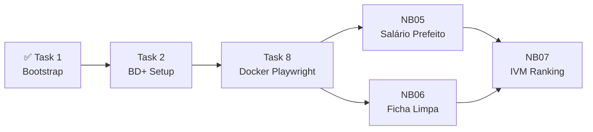

# Abner Fonseca — Tarefas e Estudos

> **Frente:** Infraestrutura, coleta de dados complexos e IVM final.
> Você cuida de tudo que envolve setup técnico, APIs, Docker e o notebook que combina tudo.

---

## Suas Tarefas no Plano da Fase 1

---

## Task 1 — Bootstrap do Projeto
**Referência:** [Plano Fase 1 → Task 1](../superpowers/plans/2026-05-25-fase1-acre.md#task-1-bootstrap-do-projeto)

- [ ] Criar `.gitignore`
- [ ] Criar `.env.example`
- [ ] Criar `requirements.txt`
- [ ] Criar estrutura de pastas (`data/raw`, `data/processed`, `notebooks/fase1_acre`)
- [ ] Rodar `pip install -r requirements.txt && playwright install chromium`
- [ ] Commit: `chore: bootstrap estrutura do projeto fase 1`

---

## Task 2 — Google Cloud + BD+ Setup
**Referência:** [Plano Fase 1 → Task 2](../superpowers/plans/2026-05-25-fase1-acre.md#task-2-setup-bd-e-validação-da-conexão)

- [ ] Criar conta no [Google Cloud Console](https://console.cloud.google.com) (gratuita)
- [ ] Criar projeto: `analise-municipios-br`
- [ ] Ativar a **BigQuery API**
- [ ] Criar Service Account com role `BigQuery Job User`
- [ ] Baixar chave `.json` → salvar como `gcp-service-account.json` (não commitar!)
- [ ] Obter token gratuito da [API Portal da Transparência](https://api.portaldatransparencia.gov.br/swagger-ui)
- [ ] Preencher `.env` com as credenciais
- [ ] Criar e rodar `notebooks/fase1_acre/00_setup_validacao.ipynb`
- [ ] Confirmar output: `✅ Conexão validada — 22 municípios do Acre encontrados`
- [ ] Compartilhar as credenciais com o Miguel de forma segura (nunca via git)
- [ ] Commit: `feat: notebook de validação da conexão BD+ confirmado`

---

## Task 8 — Docker + Playwright
**Referência:** [Plano Fase 1 → Task 8](../superpowers/plans/2026-05-25-fase1-acre.md#task-8-docker--playwright-setup)

- [ ] Criar `docker/playwright/Dockerfile`
- [ ] Criar `docker/playwright/requirements.txt`
- [ ] Criar `scrapers/base.py` (classe com cache e rate limiting)
- [ ] Criar `scrapers/tse_ficha_limpa.py`
- [ ] Build do container: `docker build -t playwright-scraper -f docker/playwright/Dockerfile .`
- [ ] Testar container sobe sem erros
- [ ] Commit: `feat: Playwright Docker setup com scraper TSE ficha limpa`

---

## NB05 — Salário do Prefeito vs. População
**Referência:** [Plano Fase 1 → Task 7](../superpowers/plans/2026-05-25-fase1-acre.md#task-7-notebook-05--salário-prefeito-vs-população)
**Depende de:** Task 2 (token API), NB03 do Miguel (salário médio da população via RAIS)

- [ ] Criar `notebooks/fase1_acre/05_salario_prefeito_pop_ac.ipynb`
- [ ] Buscar salários via API Portal da Transparência com cache local
- [ ] Cruzar com `data/processed/social_emprego_ac.json` (gerado pelo Miguel no NB03)
- [ ] Calcular razão: salário prefeito ÷ salário médio da população
- [ ] Gráfico: municípios onde o prefeito ganha mais vezes a média local
- [ ] Salvar em `data/processed/salarios_prefeitos_ac.json`
- [ ] Commit: `feat(nb05): comparativo salário prefeito vs. média salarial local`

---

## NB06 — Ficha dos Prefeitos (Playwright)
**Referência:** [Plano Fase 1 → Task 9](../superpowers/plans/2026-05-25-fase1-acre.md#task-9-notebook-06--ficha-dos-prefeitos)
**Depende de:** Task 8 (Docker), NB02 do Miguel (lista de prefeitos eleitos)

- [ ] Criar `notebooks/fase1_acre/06_ficha_limpa_prefeitos_ac.ipynb`
- [ ] Buscar candidatos eleitos via BD+
- [ ] Usar `TSEFichaLimpaScraper` para coletar situação de cada um
- [ ] Enriquecer dataset com ficha limpa
- [ ] Análise: distribuição ficha limpa × com restrições × por partido
- [ ] Salvar em `data/processed/ficha_prefeitos_ac.json`
- [ ] Commit: `feat(nb06): ficha limpa dos prefeitos eleitos no Acre via Playwright`

---

## NB07 — IVM Ranking (fazer junto com Miguel)
**Referência:** [Plano Fase 1 → Task 10](../superpowers/plans/2026-05-25-fase1-acre.md#task-10-notebook-07--ranking-ivm)
**Depende de:** TODOS os notebooks anteriores finalizados

- [ ] Criar `notebooks/fase1_acre/07_ivm_ranking_ac.ipynb`
- [ ] Carregar todos os `data/processed/*.json`
- [ ] Aplicar normalização MinMax por dimensão
- [ ] Calcular IVM com os 6 pesos
- [ ] Gerar ranking das 22 cidades com score 0–100
- [ ] Exportar `data/processed/ivm_ranking_ac_fase1.csv` e `.parquet`
- [ ] Commit: `feat(nb07): IVM calculado e ranking final dos municípios do Acre`

---

## O que Você Precisa Estudar

### Prioritário (antes de começar)

| Tema | Por que | Onde estudar |
|------|---------|-------------|
| **Google Cloud BigQuery** | Setup da Task 2 | [Quickstart BigQuery](https://cloud.google.com/bigquery/docs/quickstarts/query-public-dataset-console) |
| **Base dos Dados (BD+)** | Fonte principal de dados | [Documentação BD+](https://basedosdados.org/docs) |
| **python-dotenv** | Gerenciar `.env` com segurança | `pip show python-dotenv` |

### Durante o projeto

| Tema | Quando usar | Onde estudar |
|------|-------------|-------------|
| **requests + autenticação por header** | NB05 — API Transparência | [Docs requests](https://docs.python-requests.org) |
| **Playwright Python sync API** | Task 8 + NB06 | [Playwright Python Docs](https://playwright.dev/python/docs/intro) |
| **Docker volumes e ENTRYPOINT** | Task 8 | [Docker Docs](https://docs.docker.com/get-started/) |
| **sklearn MinMaxScaler** | NB07 — IVM | [scikit-learn docs](https://scikit-learn.org/stable/modules/generated/sklearn.preprocessing.MinMaxScaler.html) |

### Leitura de referência do projeto

| Documento | Leia quando |
|-----------|-------------|
| [Fluxo de Coleta](../fluxo-coleta.md) | Antes das Tasks 2 e 8 |
| [IVM Metodologia](../ivm-metodologia.md) | Antes do NB07 |
| [Fontes Pesquisadas](../fontes-de-dados/fontes-pesquisadas.md) | Para entender as APIs |

---

## Pontos de Sincronização com o Miguel

| Sync | Quando | O que entregar |
|------|--------|----------------|
| **Sync 1** | Após Task 2 | BD+ funcionando — compartilhar `.env` com Miguel de forma segura |
| **Sync 2** | Após Miguel terminar NB01–04 | Revisar análises juntos antes de Abner construir o IVM |
| **Sync 3** | Após Task 8 + NB05/06 | Testar Docker juntos, verificar `data/processed/` completo |
| **Sync 4** | NB07 | Construir o IVM juntos — decisão dos pesos é dos dois |
