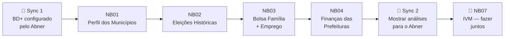

# Miguel — Tarefas e Estudos

> **Frente:** Análise exploratória e visualizações.
> Você é responsável pelos 4 primeiros notebooks — os que respondem as perguntas
> mais importantes sobre a população e a gestão de cada cidade.

---

## Suas Tarefas no Plano da Fase 1

---

## Antes de Começar

Você precisa que o Abner termine a **Task 2** (Google Cloud + BD+ setup) e te passe:
- O arquivo `.env` preenchido (ou as credenciais de forma segura)
- Confirmação de que `00_setup_validacao.ipynb` rodou com sucesso

Depois disso, você trabalha de forma totalmente independente até o **Sync 2**.

---

## NB01 — Perfil dos Municípios do Acre
**Referência:** [Plano Fase 1 → Task 3](../superpowers/plans/2026-05-25-fase1-acre.md#task-3-notebook-01--perfil-dos-municípios)
**Pergunta central:** Como são os municípios do Acre? Tamanho, IDH, distribuição.

- [ ] Criar `notebooks/fase1_acre/01_perfil_municipios_ac.ipynb`
- [ ] Buscar população por município/ano (`br_ibge_populacao.municipio`)
- [ ] Buscar IDH municipal (`br_ipea_idhm.municipio`)
- [ ] Criar ranking por população (bar chart)
- [ ] Criar evolução populacional das 5 maiores cidades (line chart)
- [ ] Criar scatter: IDH vs. população (com tamanho = população)
- [ ] Rodar as asserções de qualidade
- [ ] Salvar `data/processed/perfil_municipios_ac.json`
- [ ] Commit: `feat(nb01): perfil dos municípios do Acre com ranking e IDH`

---

## NB02 — Eleições Históricas
**Referência:** [Plano Fase 1 → Task 4](../superpowers/plans/2026-05-25-fase1-acre.md#task-4-notebook-02--eleições-históricas)
**Pergunta central:** Quem governa cada cidade do Acre desde 2000? Qual partido domina?

- [ ] Criar `notebooks/fase1_acre/02_eleicoes_historico_ac.ipynb`
- [ ] Buscar resultados eleitorais (`br_tse_eleicoes.resultados_candidato_municipio`)
- [ ] Buscar perfil do eleitorado (`br_tse_eleicoes.perfil_eleitorado`)
- [ ] Criar bar chart: mandatos por partido (2000–2024)
- [ ] Criar line chart: comparecimento médio por eleição
- [ ] Criar timeline de gestões por município (quem governou quando, colorido por partido)
- [ ] Calcular: `% comparecimento = comparecimento / eleitores_cadastrados * 100`
- [ ] Rodar asserções e salvar `data/processed/eleicoes_prefeitos_ac.json`
- [ ] Commit: `feat(nb02): histórico eleitoral e domínio partidário no Acre`

---

## NB03 — Bolsa Família + Emprego
**Referência:** [Plano Fase 1 → Task 5](../superpowers/plans/2026-05-25-fase1-acre.md#task-5-notebook-03--bolsa-família--emprego)
**Pergunta central:** Qual a dependência social de cada cidade? Existe correlação com emprego formal?

> ⚠️ **Este notebook alimenta o NB05 do Abner.** O arquivo `data/processed/social_emprego_ac.json`
> que você gerar aqui será usado pelo Abner para calcular a razão salário/média.

- [ ] Criar `notebooks/fase1_acre/03_bolsa_familia_emprego_ac.ipynb`
- [ ] Buscar Bolsa Família (`br_mc_bolsa_familia.municipio`)
- [ ] Buscar emprego formal RAIS (`br_me_rais.microdados_vinculos`) — **tabela grande**, filtrar `sigla_uf = 'AC'`
- [ ] Calcular `% famílias com BF = (familias_bf * 3.5 / populacao) * 100`
- [ ] Calcular `% emprego formal = vinculos_ativos / populacao * 100`
- [ ] Criar scatter: % Bolsa Família vs. % emprego formal (tamanho = população)
- [ ] Documentar: qual cidade é mais dependente? Qual tem mais emprego formal?
- [ ] Rodar asserções e salvar `data/processed/social_emprego_ac.json`
- [ ] Commit: `feat(nb03): análise de dependência social vs emprego formal no Acre`

---

## NB04 — Finanças das Prefeituras
**Referência:** [Plano Fase 1 → Task 6](../superpowers/plans/2026-05-25-fase1-acre.md#task-6-notebook-04--finanças-das-prefeituras)
**Pergunta central:** As prefeituras do Acre cumprem a Lei de Responsabilidade Fiscal?

- [ ] Criar `notebooks/fase1_acre/04_financas_prefeituras_ac.ipynb`
- [ ] Buscar dados do SICONFI (`br_siconfi.municipios`)
- [ ] Calcular `dívida / receita líquida` por município
- [ ] Calcular `% gasto com pessoal` por município
- [ ] Aplicar semáforo LRF:
  - ✅ Saudável: gasto pessoal ≤ 45%
  - ⚠️ Atenção: entre 45% e 54%
  - 🔴 Irregular: acima de 54%
- [ ] Criar bar chart com semáforo de dívida por município
- [ ] Criar gráfico de composição de gastos (saúde, educação, pessoal, obras)
- [ ] Rodar asserções e salvar `data/processed/financas_ac.json`
- [ ] Commit: `feat(nb04): análise financeira das prefeituras do Acre com semáforo LRF`

---

## NB07 — IVM Ranking (fazer junto com Abner)
**Depende de:** NB01–06 todos finalizados

- [ ] Participar do Sync 4 com Abner
- [ ] Revisar pesos do IVM antes de calcular
- [ ] Validar os resultados: o ranking faz sentido intuitivamente?
- [ ] Documentar pelo menos 3 insights surpreendentes encontrados

---

## O que Você Precisa Estudar

### Prioritário (antes de começar)

| Tema | Por que | Onde estudar |
|------|---------|-------------|
| **pandas — merge e groupby** | Cruzar múltiplas fontes em todos os notebooks | [pandas User Guide](https://pandas.pydata.org/docs/user_guide/merging.html) |
| **Plotly Express** | Todas as visualizações | [Plotly Express Docs](https://plotly.com/python/plotly-express/) |
| **bd.read_sql()** | Buscar dados do BD+ | [BD+ Python Docs](https://basedosdados.org/docs/access_data_packages) |

### Durante o projeto

| Tema | Quando usar | Onde estudar |
|------|-------------|-------------|
| **pandas — pivot_table** | NB02 — timeline de partidos | [pandas pivot_table](https://pandas.pydata.org/docs/reference/api/pandas.pivot_table.html) |
| **pd.cut()** | NB04 — semáforo LRF | [pandas cut](https://pandas.pydata.org/docs/reference/api/pandas.cut.html) |
| **Plotly timeline** | NB02 — gestões ao longo do tempo | [Plotly Timeline](https://plotly.com/python/gantt/) |
| **Correlação com df.corr()** | NB03 — BF vs emprego | [pandas corr](https://pandas.pydata.org/docs/reference/api/pandas.DataFrame.corr.html) |

### Leitura de referência do projeto

| Documento | Leia quando |
|-----------|-------------|
| [Guia dos Notebooks](../notebooks-guia.md) | Antes de começar — mostra o que cada notebook deve responder |
| [Fontes Pesquisadas](../fontes-de-dados/fontes-pesquisadas.md) | Para entender as tabelas do BD+ |
| [IVM Metodologia](../ivm-metodologia.md) | Antes do Sync 4 — entender como seus dados entram no índice |

---

## Tabelas BD+ que Você Vai Usar

| Notebook | Tabela | Filtro |
|----------|--------|--------|
| NB01 | `basedosdados.br_ibge_populacao.municipio` | `sigla_uf = 'AC'` |
| NB01 | `basedosdados.br_ipea_idhm.municipio` | `sigla_uf = 'AC'` |
| NB02 | `basedosdados.br_tse_eleicoes.resultados_candidato_municipio` | `sigla_uf = 'AC' AND cargo = 'PREFEITO'` |
| NB02 | `basedosdados.br_tse_eleicoes.perfil_eleitorado` | `sigla_uf = 'AC'` |
| NB03 | `basedosdados.br_mc_bolsa_familia.municipio` | `sigla_uf = 'AC'` |
| NB03 | `basedosdados.br_me_rais.microdados_vinculos` | `sigla_uf = 'AC'` — **arquivo grande, pode demorar** |
| NB04 | `basedosdados.br_siconfi.municipios` | `sigla_uf = 'AC'` |

**Chave de JOIN em todos:** `id_municipio` (código IBGE de 7 dígitos, ex: `1200013` = Acrelândia/AC)

---

## Pontos de Sincronização com o Abner

| Sync | Quando | O que você precisa |
|------|--------|-------------------|
| **Sync 1** | Antes de começar | `.env` do Abner + confirmação BD+ funcionando |
| **Sync 2** | Após NB01–04 prontos | Mostrar análises, discutir insights, Abner revisa |
| **Sync 3** | Após NB05/06 do Abner | `data/processed/` completo para ambos verificarem |
| **Sync 4** | NB07 — IVM final | Construir ranking juntos |
