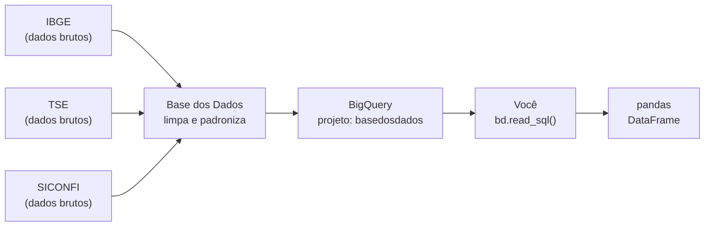

# Guia: BigQuery + Base dos Dados (BD+)

> **O que você vai aprender:** o que é o BigQuery, por que usamos ele, como o BD+ se encaixa,
> e como escrever sua primeira query para buscar dados dos municípios do Acre.

---

## 1. O que é o BigQuery?

BigQuery é um **banco de dados em nuvem da Google** — você não instala nada na sua máquina.
Os dados ficam nos servidores da Google e você faz queries SQL de qualquer lugar.

A diferença para um banco tradicional como PostgreSQL:

| | PostgreSQL (tradicional) | BigQuery |
|--|--------------------------|---------|
| Onde roda | Sua máquina ou servidor | Nuvem Google |
| Instalação | Sim | Não — só uma conta |
| Custo | Grátis (self-hosted) | Grátis até 1 TB/mês de queries |
| Ideal para | Aplicações, APIs | Análise de grandes volumes |
| Como acessa | `psycopg2`, `sqlalchemy` | `google-cloud-bigquery`, BD+ SDK |

**Analogia:** PostgreSQL é como ter um arquivo físico no seu escritório. BigQuery é uma biblioteca pública gigante na nuvem — você consulta de casa, sem precisar guardar nada.

---

## 2. O que é a Base dos Dados (BD+)?

BD+ é uma organização brasileira que:
1. Pega dados brutos do IBGE, TSE, SICONFI, RAIS, etc.
2. Limpa, normaliza e padroniza
3. Coloca tudo no BigQuery **em projetos públicos**
4. Você consulta de graça sem precisar baixar e limpar nada



**O projeto público deles se chama `basedosdados`.** Você consulta os dados deles,
mas o custo de processamento é cobrado no **seu** projeto Google Cloud — que tem 1 TB grátis por mês.

---

## 3. Como configurar (passo a passo com prints mentais)

### 3.1 Criar conta e projeto no Google Cloud

```
1. Acesse: https://console.cloud.google.com
2. Faça login com uma conta Google
3. Clique em "Select a project" (canto superior esquerdo)
4. Clique em "New Project"
5. Nome do projeto: analise-municipios-br
6. Clique em "Create"
```

> ⚠️ O Google pede cartão de crédito para verificação de identidade.
> **Ele NÃO cobra nada** enquanto você ficar abaixo de 1 TB/mês de queries.
> Uma query típica deste projeto usa ~50–200 MB.

### 3.2 Ativar a BigQuery API

```
1. No menu lateral: APIs e Serviços → Biblioteca
2. Buscar: "BigQuery API"
3. Clicar em Ativar
```

### 3.3 Criar Service Account (chave de acesso)

Uma Service Account é como um "usuário robô" que seu script Python vai usar para se autenticar.

```
1. IAM e administrador → Contas de serviço
2. Clique em "Criar conta de serviço"
3. Nome: bq-reader
4. Clique em "Continuar"
5. Função: BigQuery → BigQuery Job User
6. Clique em "Concluir"

Agora criar a chave:
7. Clique na conta de serviço criada
8. Aba "Chaves" → Adicionar chave → Criar nova chave
9. Tipo: JSON → Criar
10. Um arquivo .json é baixado automaticamente
11. Mova esse arquivo para a raiz do projeto
    Renomeie para: gcp-service-account.json
```

> 🔒 **NUNCA commite esse arquivo no git.** Ele já está no `.gitignore`.

### 3.4 Configurar o .env

```bash
# Abrir o .env e preencher:
GCP_PROJECT_ID=analise-municipios-br
GOOGLE_APPLICATION_CREDENTIALS=./gcp-service-account.json
```

---

## 4. Como o bd.read_sql() funciona

```python
import basedosdados as bd

df = bd.read_sql(
    query="SELECT ...",              # sua query SQL
    billing_project_id="seu-projeto" # onde o custo é cobrado (seu projeto gratuito)
)
# df é um pandas DataFrame pronto para usar
```

**Por que dois projetos?**
- `basedosdados` — onde os dados moram (projeto deles, público)
- `analise-municipios-br` — onde o custo é cobrado (seu projeto, gratuito até 1 TB)

---

## 5. Estrutura dos datasets do BD+

No BigQuery, os dados são organizados assim:

```
projeto.dataset.tabela

basedosdados.br_ibge_populacao.municipio
│            │                 └── tabela
│            └── dataset (grupo de tabelas relacionadas)
└── projeto (sempre "basedosdados" para dados do BD+)
```

### Datasets que vamos usar neste projeto:

| Dataset | O que contém |
|---------|-------------|
| `br_ibge_populacao` | População por município/ano |
| `br_ipea_idhm` | IDH Municipal histórico |
| `br_tse_eleicoes` | Eleições, candidatos, resultados |
| `br_me_rais` | Emprego formal (RAIS) |
| `br_mc_bolsa_familia` | Bolsa Família por município |
| `br_siconfi` | Finanças municipais (SICONFI) |

---

## 6. Queries do projeto — com explicação linha a linha

### Query 1 — População do Acre

```sql
SELECT
    id_municipio,   -- código IBGE de 7 dígitos (ex: 1200013 = Acrelândia)
    nome,           -- nome do município
    ano,            -- qual ano do dado
    populacao       -- estimativa populacional do IBGE
FROM `basedosdados.br_ibge_populacao.municipio`
WHERE sigla_uf = 'AC'          -- só o Acre
ORDER BY ano DESC, populacao DESC  -- mais recente primeiro, maior cidade primeiro
```

### Query 2 — Cruzamento eleições + eleitores (JOIN)

O JOIN conecta duas tabelas pelo `id_municipio`:

```sql
SELECT
    e.id_municipio,
    e.nome_candidato,
    e.sigla_partido,
    e.total_votos,
    el.qtd_eleitores_perfil AS eleitores_cadastrados  -- renomear coluna
FROM `basedosdados.br_tse_eleicoes.resultados_candidato_municipio` e
--   ↑ tabela principal (alias "e" de eleicoes)

LEFT JOIN `basedosdados.br_tse_eleicoes.perfil_eleitorado` el
--        ↑ tabela secundária (alias "el" de eleitorado)
    ON e.id_municipio = el.id_municipio  -- conectar pelo mesmo município
    AND e.ano_eleicao = el.ano           -- e pelo mesmo ano

WHERE e.sigla_uf = 'AC'
  AND e.cargo = 'PREFEITO'
  AND e.resultado = 'ELEITO'
```

**Por que LEFT JOIN e não JOIN?**
Se usarmos `JOIN` (inner join), municípios sem dado na tabela de eleitorado
somem do resultado. `LEFT JOIN` mantém todos os municípios e coloca `NULL`
onde não tem dado de eleitorado — mais seguro para análise.

---

## 7. Erros comuns e como resolver

| Erro | Causa | Solução |
|------|-------|---------|
| `DefaultCredentialsError` | `.env` não carregado ou caminho errado do JSON | Verificar `load_dotenv()` e o caminho no `.env` |
| `403 Access Denied` | Service Account sem permissão | Adicionar role `BigQuery Job User` |
| `404 Not Found: Table` | Nome da tabela errado | Verificar no [BD+ Catalog](https://basedosdados.org/dataset) |
| `billingNotEnabled` | Projeto sem billing ativado | Ativar billing no Google Cloud (gratuito) |
| Query devolveu 0 linhas | Filtro errado | Testar sem o WHERE primeiro |

---

## 8. Como explorar as tabelas do BD+

Antes de escrever a query completa, explore a tabela:

```python
# Ver primeiras linhas sem trazer tudo
df_amostra = bd.read_sql("""
    SELECT *
    FROM `basedosdados.br_ibge_populacao.municipio`
    WHERE sigla_uf = 'AC'
    LIMIT 5
""", billing_project_id="analise-municipios-br")

# Ver nomes e tipos das colunas
print(df_amostra.dtypes)
print(df_amostra.head())
```

Ou pelo site: **https://basedosdados.org/dataset** → buscar o dataset → clicar em "Ver tabela"

---

## 9. Quanto custa cada query?

Para estimar antes de rodar:

```python
from google.cloud import bigquery

client = bigquery.Client(project="analise-municipios-br")

job_config = bigquery.QueryJobConfig(dry_run=True)  # não executa, só estima
query = "SELECT * FROM `basedosdados.br_me_rais.microdados_vinculos` WHERE sigla_uf = 'AC'"

job = client.query(query, job_config=job_config)
gb = job.total_bytes_processed / (1024**3)
print(f"Esta query processaria: {gb:.2f} GB")
print(f"Custo estimado: {'GRÁTIS' if gb < 1000 else f'${gb/1024*5:.2f}'}")
```

> Para o Acre inteiro, a maioria das queries usa < 0.1 GB. Só a RAIS pode ser maior — teste com `LIMIT 1000` primeiro.
