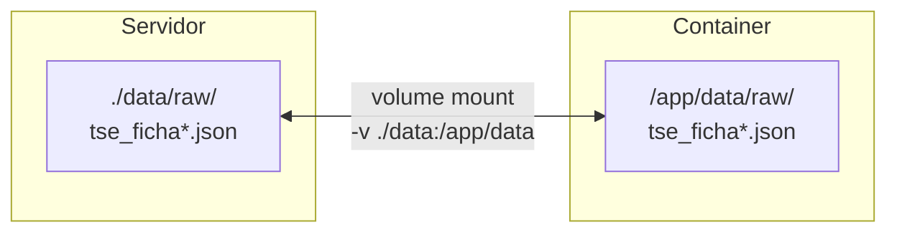
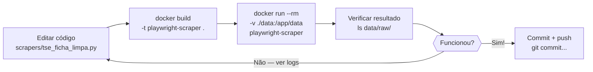

# Guia: Docker para Rodar o Playwright

> **O que você vai aprender:** o que é Docker, por que usamos ele para o Playwright,
> como criar um Dockerfile, build e rodar o container no seu servidor.

---

## 1. Por que Docker para o Playwright?

O Playwright precisa de um browser real (Chromium) instalado. Isso é simples no desenvolvimento
local, mas no servidor tem problemas:

| Problema | Sem Docker | Com Docker |
|----------|-----------|------------|
| Instalar Chromium no servidor | Dependências complexas, pode quebrar | Já vem pronto na imagem |
| Ambiente diferente do dev | "Funciona na minha máquina" | Mesmo ambiente em todo lugar |
| Atualizar dependências | Pode quebrar outros projetos | Isolado — não afeta nada fora |
| Rodar múltiplos scrapers | Conflito de versões | Cada container isolado |

**Analogia:** Docker é como uma caixa postal selada. Tudo que o programa precisa vai
dentro da caixa (sistema, Python, Chromium, bibliotecas). Você manda a caixa para qualquer
servidor e ela funciona igual.

---

## 2. Conceitos essenciais

```
Imagem (Image)
│  Receita de como criar o container
│  Definida no Dockerfile
│  Exemplo: playwright-scraper:latest
│
└── Container
       Uma instância rodando da imagem
       Como um processo isolado
       Pode rodar muitos containers da mesma imagem
```

### Dockerfile — a receita

```dockerfile
# Imagem base = ponto de partida
# Essa imagem já tem Python + Chromium instalados
FROM mcr.microsoft.com/playwright/python:v1.44.0-jammy

# Definir diretório de trabalho dentro do container
WORKDIR /app

# Copiar requirements ANTES do código (aproveitar cache de camadas)
COPY docker/playwright/requirements.txt .

# Instalar dependências Python
RUN pip install --no-cache-dir -r requirements.txt

# Copiar o código do projeto
COPY scrapers/ ./scrapers/
COPY data/ ./data/

# Comando padrão quando o container iniciar
CMD ["python", "scrapers/tse_ficha_limpa.py"]
```

**Por que copiar `requirements.txt` antes do código?**
Docker usa cache por camada. Se você copiasse tudo de uma vez com `COPY . .`,
qualquer mudança no código (até um comentário) invalidaria o cache do `pip install`
e ele reinstalaria tudo. Separar é muito mais rápido no desenvolvimento.

---

## 3. Estrutura de arquivos do nosso projeto

```
projeto/
├── docker/
│   └── playwright/
│       ├── Dockerfile          ← receita do container
│       └── requirements.txt    ← dependências do scraper
├── scrapers/
│   ├── base.py                 ← BaseScraper (cache + rate limiting)
│   └── tse_ficha_limpa.py      ← scraper concreto
└── data/
    ├── raw/                    ← cache dos scrapers
    └── processed/              ← dados prontos para análise
```

### `docker/playwright/requirements.txt`

```txt
playwright==1.44.0
python-dotenv==1.0.1
```

Separado do `requirements.txt` principal do projeto porque o container do Playwright
não precisa do pandas, basedosdados, plotly — só do que o scraper usa.
Imagem menor = build mais rápido.

---

## 4. Build do container

```bash
# Na raiz do projeto:
docker build \
  -t playwright-scraper \          # nome:tag da imagem
  -f docker/playwright/Dockerfile \ # qual Dockerfile usar
  .                                 # contexto = diretório atual (. = raiz)
```

**O que acontece durante o build:**

```
Step 1/6 : FROM mcr.microsoft.com/playwright/python:v1.44.0-jammy
 → Baixa a imagem base (só na primeira vez)

Step 2/6 : WORKDIR /app
 → Cria o diretório /app dentro do container

Step 3/6 : COPY docker/playwright/requirements.txt .
 → Copia o arquivo para /app/requirements.txt no container

Step 4/6 : RUN pip install --no-cache-dir -r requirements.txt
 → Instala playwright e python-dotenv (fica em cache se requirements não mudou)

Step 5/6 : COPY scrapers/ ./scrapers/
 → Copia seus scrapers para /app/scrapers/

Step 6/6 : COPY data/ ./data/
 → Copia a pasta data/ (inclui cache existente)

Successfully built a1b2c3d4e5f6
Successfully tagged playwright-scraper:latest
```

---

## 5. Rodar o container

### Rodar uma vez e ver o resultado

```bash
docker run \
  --rm \                              # remover container após terminar
  -v $(pwd)/data:/app/data \          # montar pasta data (persistência do cache)
  -e GCP_PROJECT_ID=analise-municipios-br \  # variável de ambiente
  playwright-scraper \                # imagem
  python scrapers/tse_ficha_limpa.py  # comando
```

**`-v $(pwd)/data:/app/data`** — isso é um **volume mount**.
Sem isso, os arquivos criados dentro do container somem quando ele termina.
Com o mount, o container escreve em `/app/data/` que na verdade é `./data/` no seu
servidor — os arquivos ficam salvos.



### Usando arquivo .env

Em vez de passar variáveis uma a uma, use `--env-file`:

```bash
docker run \
  --rm \
  -v $(pwd)/data:/app/data \
  --env-file .env \           # carrega todas as variáveis do .env
  playwright-scraper \
  python scrapers/tse_ficha_limpa.py
```

---

## 6. Comandos úteis do dia a dia

```bash
# Listar imagens criadas
docker images

# Listar containers rodando agora
docker ps

# Listar todos os containers (inclusive os que terminaram)
docker ps -a

# Ver logs de um container rodando
docker logs <container_id>

# Ver logs em tempo real (como tail -f)
docker logs -f <container_id>

# Entrar no container em modo interativo (útil para debug)
docker run -it --rm playwright-scraper bash
# Dentro do container:
# ls /app/scrapers/
# python scrapers/tse_ficha_limpa.py
# exit

# Remover imagem (para forçar rebuild do zero)
docker rmi playwright-scraper
```

---

## 7. Ciclo de desenvolvimento



**Na prática:**

```bash
# 1. Editar o scraper
# nano scrapers/tse_ficha_limpa.py

# 2. Build (segundos — se requirements não mudou, usa cache)
docker build -t playwright-scraper -f docker/playwright/Dockerfile .

# 3. Rodar
docker run --rm -v $(pwd)/data:/app/data --env-file .env playwright-scraper

# 4. Verificar
ls data/raw/

# 5. Ver o que foi salvo
cat data/raw/tse_ficha_municipio_1200013.json
```

---

## 8. Debug — quando algo não funciona

### Ver o erro completo

```bash
# O container saiu com código != 0 — ver os logs
docker run --rm -v $(pwd)/data:/app/data --env-file .env playwright-scraper 2>&1 | tail -50
```

### Entrar no container e rodar manualmente

```bash
# Abrir bash dentro do container com o ambiente configurado
docker run -it --rm \
  -v $(pwd)/data:/app/data \
  --env-file .env \
  playwright-scraper \
  bash

# Dentro do container:
python scrapers/tse_ficha_limpa.py    # rodar e ver erro diretamente
python -c "from scrapers.base import BaseScraper; print('import ok')"
ls /app/data/raw/                      # verificar arquivos
```

### Screenshot para ver o que o browser está vendo

```python
# Adicionar temporariamente no scraper:
page.screenshot(path="/app/data/debug.png")
```

```bash
# Após rodar o container, o arquivo estará em:
ls data/debug.png
# Abrir para ver o que o Playwright estava vendo
```

---

## 9. Erros comuns e soluções

| Erro | Causa | Solução |
|------|-------|---------|
| `Cannot connect to Docker daemon` | Docker não está rodando | `sudo systemctl start docker` |
| `permission denied while trying to connect` | Usuário não está no grupo docker | `sudo usermod -aG docker $USER` + logout/login |
| `No such file or directory` no COPY | Caminho no Dockerfile errado | Verificar que o arquivo existe no contexto de build |
| `ModuleNotFoundError: No module named 'scrapers'` | PYTHONPATH não configurado | Adicionar `ENV PYTHONPATH=/app` no Dockerfile |
| Container sobe e fecha imediatamente | Script termina com erro | `docker run ... bash` e rodar manualmente |
| `data/` vazia após rodar | Volume não foi montado | Verificar o `-v $(pwd)/data:/app/data` |
| Build demora muito | Cache invalidado | Verificar ordem do COPY (requirements antes do código) |

---

## 10. Adicionar PYTHONPATH ao Dockerfile

O Python precisa saber onde encontrar o módulo `scrapers`. Adicione ao Dockerfile:

```dockerfile
FROM mcr.microsoft.com/playwright/python:v1.44.0-jammy

WORKDIR /app

# PYTHONPATH permite imports relativos: from scrapers.base import BaseScraper
ENV PYTHONPATH=/app

COPY docker/playwright/requirements.txt .
RUN pip install --no-cache-dir -r requirements.txt

COPY scrapers/ ./scrapers/
COPY data/ ./data/

CMD ["python", "scrapers/tse_ficha_limpa.py"]
```

---

## 11. Testar localmente sem Docker (desenvolvimento rápido)

Para iterações rápidas durante o desenvolvimento, você não precisa do Docker:

```bash
# Instalar Playwright localmente
pip install playwright==1.44.0
playwright install chromium

# Rodar direto
cd projeto/
PYTHONPATH=. python scrapers/tse_ficha_limpa.py

# Quando funcionar local, testar no Docker antes de subir para o servidor
docker build -t playwright-scraper -f docker/playwright/Dockerfile .
docker run --rm -v $(pwd)/data:/app/data --env-file .env playwright-scraper
```
