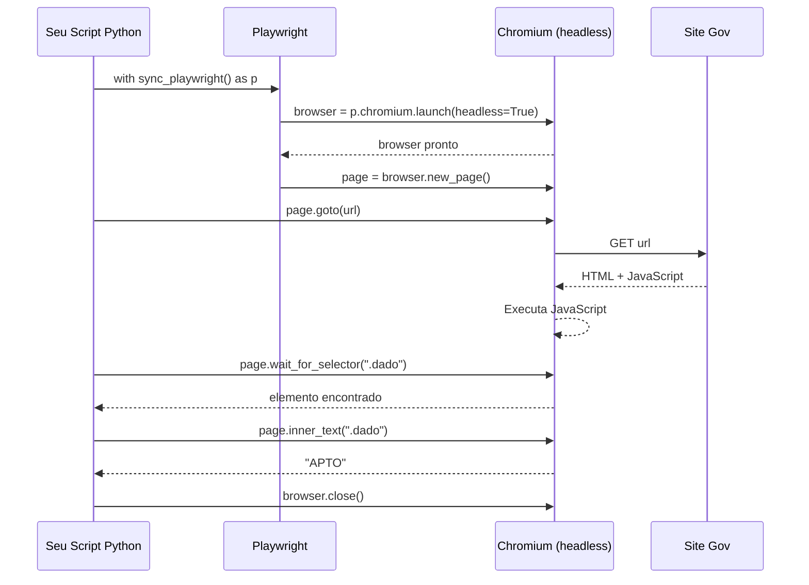

# Guia: Playwright — Scraping de Portais Governamentais

> **O que você vai aprender:** por que alguns sites precisam de Playwright, como ele funciona,
> e como escrever scrapers para o TSE e o Transferegov do nosso projeto.

---

## 1. Por que não usar requests?

`requests` baixa o HTML bruto da página — o que o servidor manda.
Muitos portais governamentais carregam o conteúdo com **JavaScript depois** que a página abre.
Quando você faz `requests.get(url)`, o JavaScript ainda não rodou:

```
requests.get("https://divulgacandcontas.tse.jus.br/...")
→ HTML chega: <div id="conteudo"></div>   ← VAZIO
→ JavaScript rodaria e preencheria o div, mas requests não espera isso
```

**Playwright abre um browser de verdade (Chromium), espera o JavaScript rodar e aí extrai o dado:**

```
playwright page.goto("https://divulgacandcontas.tse.jus.br/...")
→ Browser abre, JavaScript roda, div é preenchido
→ page.inner_text(".situacao") → "APTO"   ← DADO REAL
```

---

## 2. Como o Playwright funciona



**`headless=True`** = o browser roda sem abrir janela — ideal para servidor Docker.
Mude para `headless=False` quando quiser **ver** o que está acontecendo durante o desenvolvimento.

---

## 3. Conceitos essenciais

### Seletores CSS — como apontar para um elemento

Playwright usa seletores CSS para encontrar elementos na página:

```python
# Por tag
page.query_selector("table")

# Por classe CSS
page.query_selector(".situacao-candidato")

# Por ID
page.query_selector("#resultado-busca")

# Por atributo
page.query_selector('input[name="cpf"]')
page.query_selector('button[type="submit"]')

# Hierarquia (div dentro de section)
page.query_selector("section.candidato div.situacao")
```

> **Dica:** No Chrome, clique direito no elemento → Inspecionar → clique direito no HTML
> destacado → Copy → Copy selector. Isso gera o seletor CSS automaticamente.

### Ações principais

```python
page.goto("https://url.gov.br")              # navegar para URL
page.wait_for_load_state("networkidle")       # esperar carregar completamente
page.wait_for_selector(".classe", timeout=10000)  # esperar elemento aparecer (ms)

page.fill('input[name="cpf"]', "123.456.789-00")  # preencher campo
page.click('button[type="submit"]')           # clicar em botão
page.select_option('select[name="uf"]', "AC") # selecionar dropdown

page.inner_text(".situacao")                  # pegar texto de um elemento
page.query_selector_all("table tr")           # pegar lista de elementos
page.get_attribute(".link", "href")           # pegar atributo (ex: link href)
```

---

## 4. Estrutura de um scraper completo

Todo scraper do nosso projeto segue este padrão:

```python
from playwright.sync_api import sync_playwright, TimeoutError as PlaywrightTimeout
from scrapers.base import BaseScraper  # nossa classe com cache e rate limiting


class MeuScraper(BaseScraper):

    def coletar(self, id_municipio: str) -> dict:
        # 1. Verificar cache — não rodar Playwright se já temos o dado
        chave = f"municipio_{id_municipio}"
        cached = self.carregar_cache(chave)
        if cached:
            print(f"  Cache hit: {id_municipio}")
            return cached

        resultado = {"id_municipio": id_municipio, "dado": None, "erro": None}

        with sync_playwright() as p:
            # 2. Abrir browser
            browser = p.chromium.launch(headless=True)
            page = browser.new_page()

            try:
                # 3. Navegar para a página
                page.goto(f"https://site.gov.br/municipio/{id_municipio}", timeout=30000)
                page.wait_for_load_state("networkidle")

                # 4. Esperar o elemento aparecer
                page.wait_for_selector(".dado-principal", timeout=10000)

                # 5. Extrair o dado
                resultado["dado"] = page.inner_text(".dado-principal").strip()

            except PlaywrightTimeout:
                resultado["erro"] = "timeout — página demorou mais de 10s"
            except Exception as e:
                resultado["erro"] = str(e)
            finally:
                # 6. SEMPRE fechar o browser
                browser.close()

        # 7. Salvar no cache
        self.salvar_cache(chave, resultado)

        # 8. Rate limiting — esperar antes do próximo request
        self.esperar()

        return resultado
```

---

## 5. Extraindo tabelas inteiras

Quando o site tem uma tabela HTML com os dados:

```python
# HTML da página:
# <table>
#   <tr><td>Rio Branco</td><td>R$ 1.200.000</td><td>Concluída</td></tr>
#   <tr><td>Sena Madureira</td><td>R$ 450.000</td><td>Paralisada</td></tr>
# </table>

linhas = page.query_selector_all("table tbody tr")
obras = []
for linha in linhas:
    colunas = linha.query_selector_all("td")
    if len(colunas) >= 3:
        obras.append({
            "municipio":       colunas[0].inner_text().strip(),
            "valor_contrato":  colunas[1].inner_text().strip(),
            "status":          colunas[2].inner_text().strip(),
        })

import pandas as pd
df_obras = pd.DataFrame(obras)
```

---

## 6. Lidando com paginação

Muitos portais dividem os resultados em páginas. O padrão:

```python
todos_os_dados = []
pagina = 1

while True:
    page.goto(f"https://site.gov.br/obras?pagina={pagina}")
    page.wait_for_load_state("networkidle")

    # Extrair dados da página atual
    linhas = page.query_selector_all("table tr")
    if not linhas:
        break  # acabaram as páginas

    for linha in linhas:
        todos_os_dados.append(extrair_linha(linha))

    # Verificar se tem próxima página
    botao_proximo = page.query_selector("a.proxima-pagina")
    if not botao_proximo:
        break  # não tem mais páginas

    pagina += 1
    self.esperar()  # sempre esperar entre páginas

print(f"Total coletado: {len(todos_os_dados)} registros em {pagina} páginas")
```

---

## 7. Depurando um scraper — modo visual

Quando o scraper não funciona como esperado, rode com `headless=False` para ver o browser:

```python
# Mude temporariamente durante desenvolvimento
browser = p.chromium.launch(
    headless=False,   # abre janela visível
    slow_mo=500       # cada ação demora 500ms — você consegue acompanhar
)
```

Também dá para tirar screenshot para ver o estado da página:

```python
page.screenshot(path="debug_screenshot.png")
# Abrir o arquivo para ver o que o Playwright está vendo
```

---

## 8. Rate limiting — boas práticas

Portais governamentais são recursos públicos. Use sempre rate limiting:

```python
import time
import random

# Entre cada request: esperar 1 a 3 segundos aleatoriamente
time.sleep(random.uniform(1.0, 3.0))

# Se bloquear: exponential backoff
tentativas = 0
while tentativas < 3:
    try:
        page.goto(url, timeout=30000)
        break
    except:
        tentativas += 1
        espera = 5 * (2 ** tentativas)  # 10s, 20s, 40s
        print(f"  Erro, aguardando {espera}s antes de tentar novamente...")
        time.sleep(espera)
```

---

## 9. Erros comuns e como resolver

| Erro | Causa | Solução |
|------|-------|---------|
| `TimeoutError` | Elemento não apareceu em 30s | Site lento ou seletor errado — verificar com `headless=False` |
| `ElementNotFound` | Seletor não existe na página | Inspecionar o HTML atualizado — sites mudam |
| Browser fecha sozinho | Exception não tratada | Sempre usar `try/finally: browser.close()` |
| Dados chegam vazios | JavaScript não terminou de rodar | Usar `wait_for_load_state("networkidle")` |
| Site bloqueou IP | Muitas requests seguidas | Aumentar tempo de espera, rodar em horários diferentes |

---

## 10. Como testar sem o Docker (local)

```bash
# Instalar localmente para desenvolvimento
pip install playwright
playwright install chromium

# Rodar scraper direto
python scrapers/tse_ficha_limpa.py

# Ver o que está no cache
ls data/raw/tseficha*.json
```

Quando funcionar local, build no Docker para rodar no servidor.
