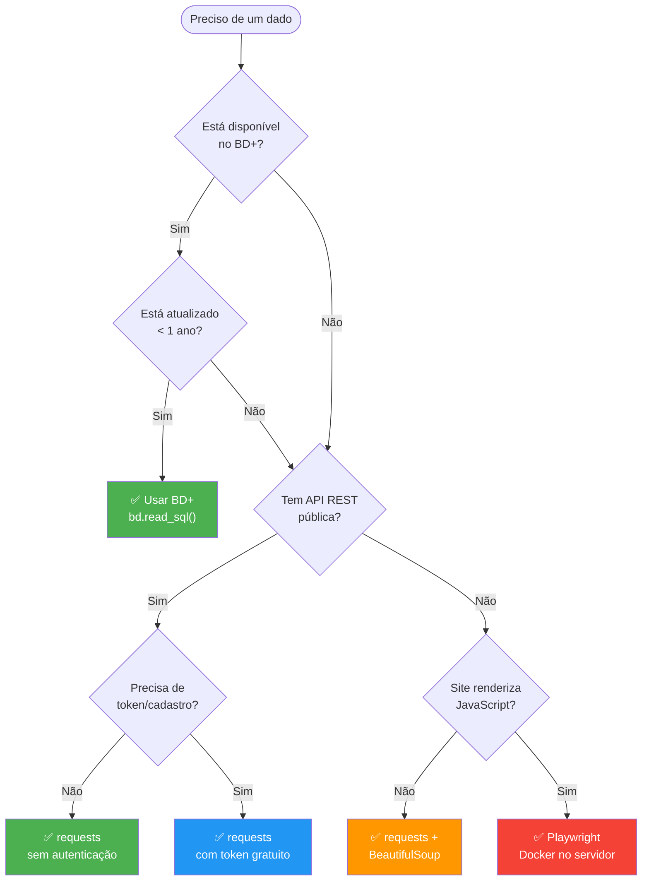
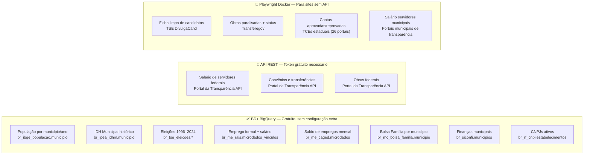
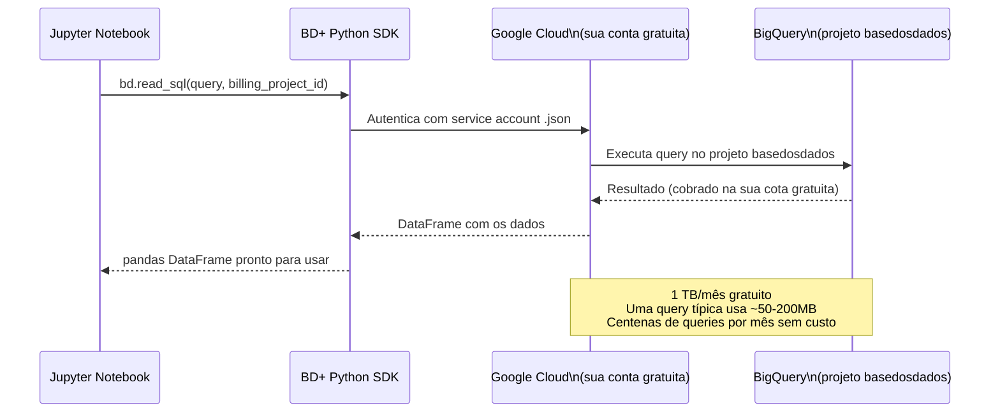
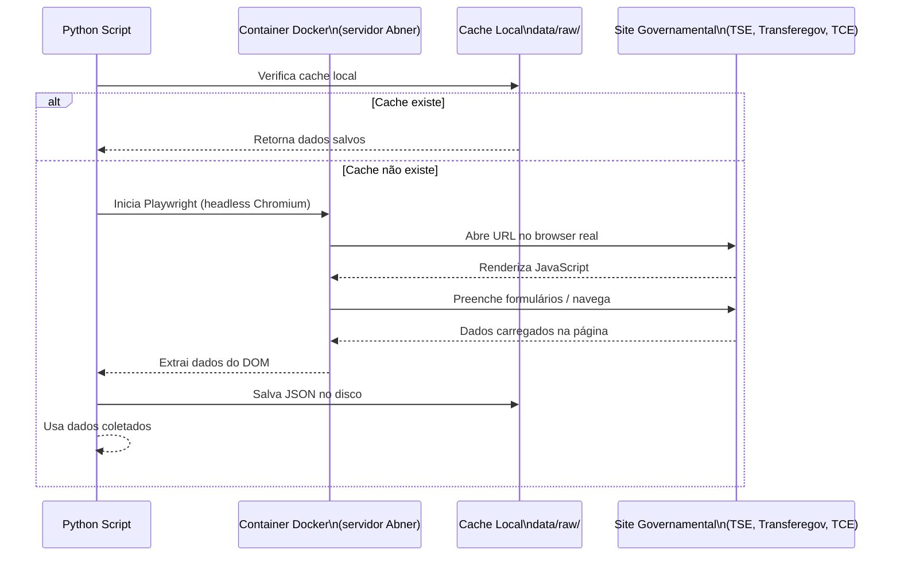
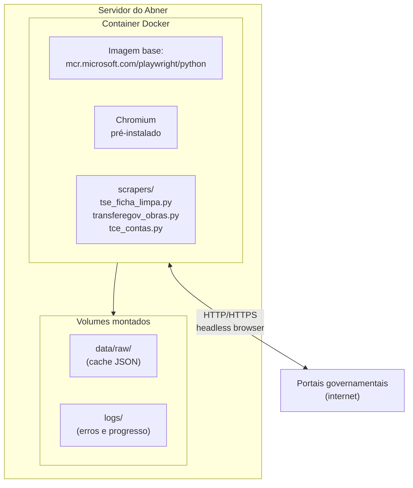
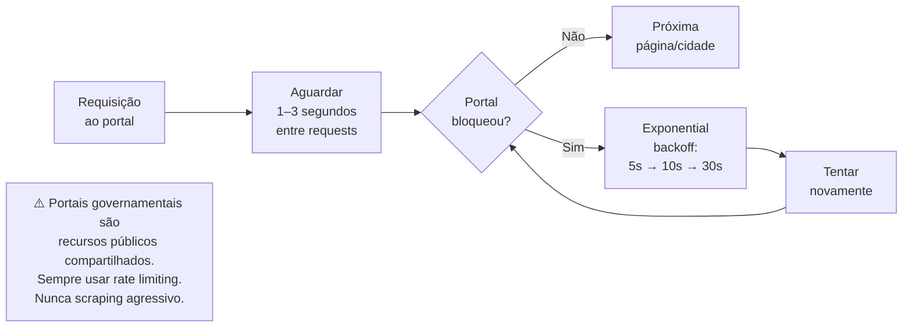

# Fluxo de Coleta de Dados

> Para cada dado que precisamos, há uma decisão: usar BD+ (rápido e gratuito)
> ou coletar por conta própria com Playwright/API (mais trabalhoso, mais controle).

---

## Árvore de Decisão: Como Coletar Cada Dado



---

## Mapa Completo: Dado → Método



---

## Como Funciona o BD+ na Prática



---

## Como Funciona o Playwright Docker



---

## Configuração do Docker para Playwright



**Comando para rodar:**
```bash
docker build -t playwright-scraper ./docker/playwright/

# Roda o scraper de ficha limpa para o Acre
docker run -v $(pwd)/data:/app/data playwright-scraper \
  python scrapers/tse_ficha_limpa.py --uf AC

# Roda todos os scrapers em paralelo por estado
docker run -v $(pwd)/data:/app/data playwright-scraper \
  python scrapers/run_all.py --uf AC --workers 3
```

---

## Rate Limiting e Boa Conduta



**Padrão de implementação:**
```python
import time
import random

def requisicao_com_espera(page, url: str, espera_min=1.0, espera_max=3.0):
    page.goto(url)
    page.wait_for_load_state("networkidle")
    # Espera aleatória para não parecer bot
    time.sleep(random.uniform(espera_min, espera_max))
```
