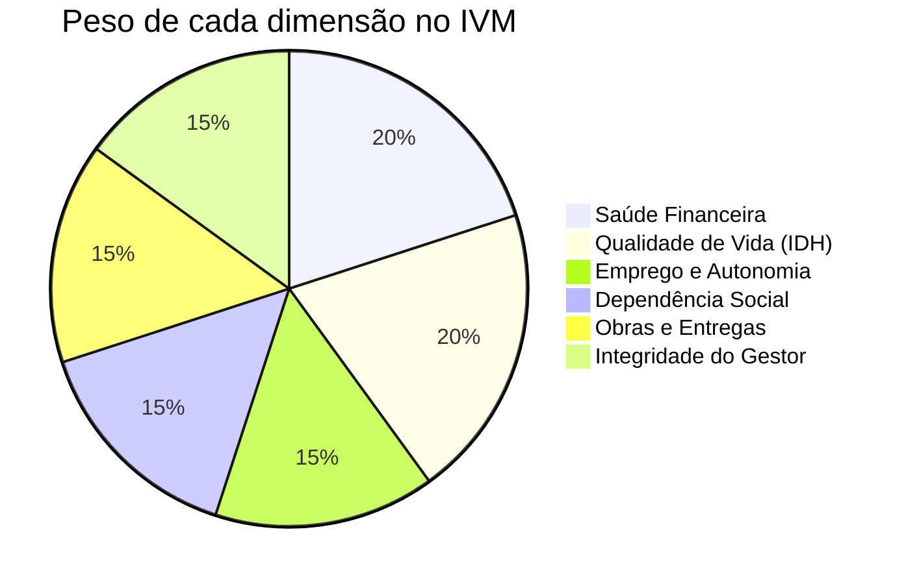
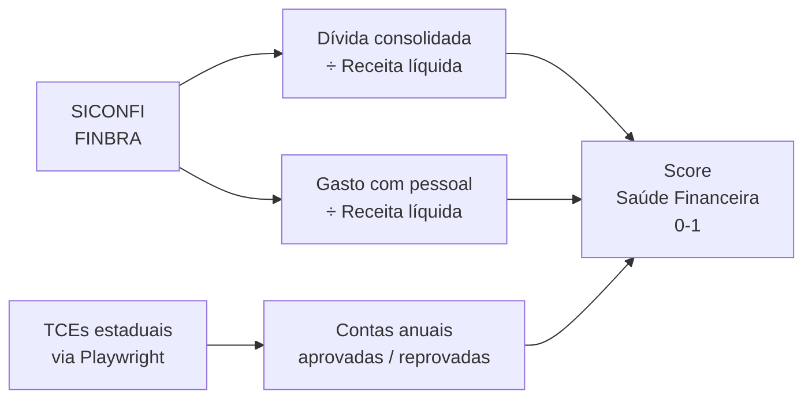
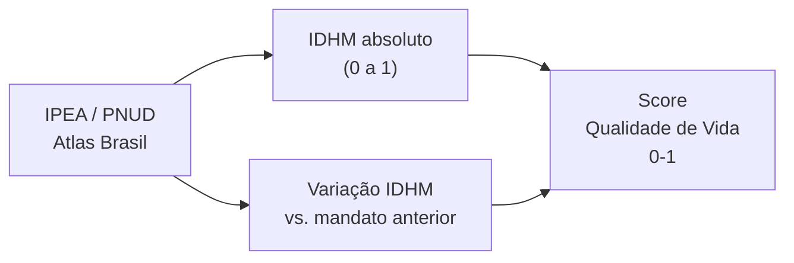
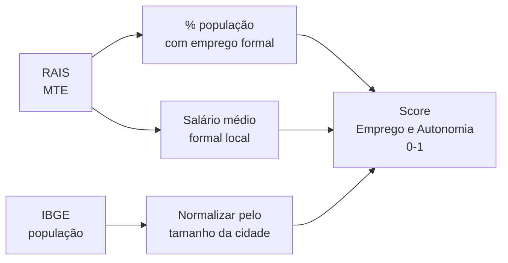
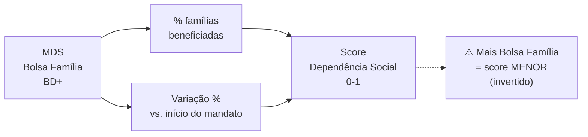
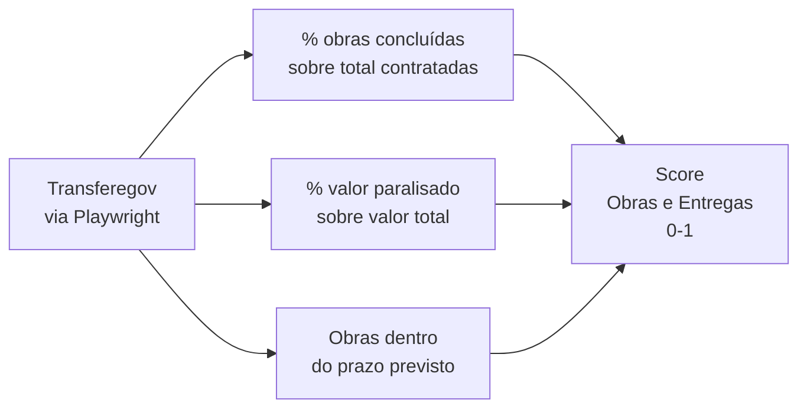
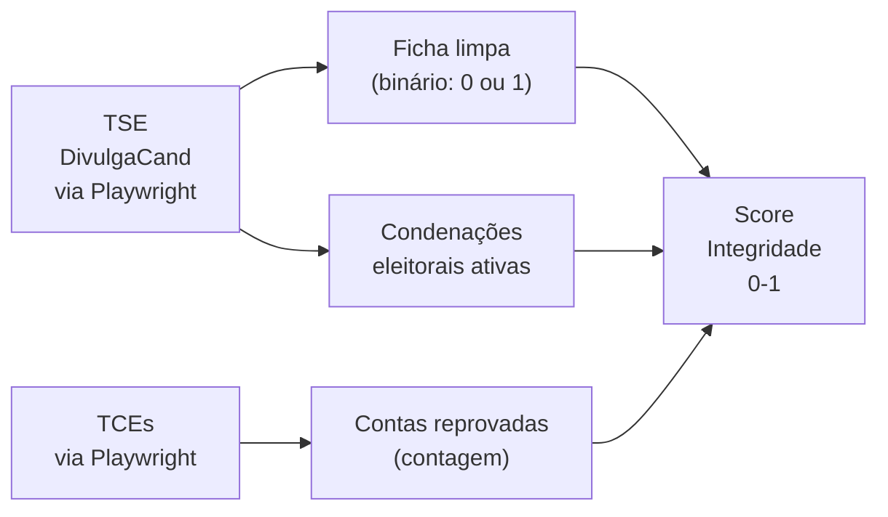

# IVM — Índice de Viabilidade Municipal

> Metodologia completa do score 0–100 que avalia cada gestão municipal.

---

## O que é o IVM?

O **Índice de Viabilidade Municipal (IVM)** é um score composto que avalia a qualidade
de cada gestão municipal combinando 6 dimensões de dados públicos.

- **0** = pior gestão possível (todos os indicadores no pior extremo)
- **100** = melhor gestão possível (todos os indicadores no melhor extremo)
- O score é calculado **por mandato** (4 anos), não por município — permite comparar
  o mesmo município em gestões diferentes

---

## As 6 Dimensões



---

## Detalhamento de Cada Dimensão

### 1. Saúde Financeira (20%)



| Métrica | Bom | Ruim | Referência |
|---------|-----|------|-----------|
| Dívida / Receita Líquida | < 1x | > 2x | LRF Art. 31 |
| Gasto com Pessoal | < 45% | > 54% | LRF Art. 19/20 |
| Contas aprovadas pelo TCE | Sim | Não | Lei 4320/64 |

---

### 2. Qualidade de Vida — IDH (20%)



> **Limitação conhecida:** O IDHM mais recente disponível é do Censo 2010 (publicado 2013).
> O Censo 2022 trará novos dados — atualizar quando publicado pelo PNUD.

---

### 3. Emprego e Autonomia (15%)



---

### 4. Dependência Social (15%)



---

### 5. Obras e Entregas (15%)



---

### 6. Integridade do Gestor (15%)



---

## Como o Score é Calculado

### Etapa 1 — Normalização MinMax

Cada métrica bruta é convertida para escala 0–1 em relação ao universo nacional:

```python
from sklearn.preprocessing import MinMaxScaler
import pandas as pd

def normalizar_metrica(serie: pd.Series, inverter: bool = False) -> pd.Series:
    """
    Normaliza uma série para 0-1.
    inverter=True para métricas onde maior valor = pior resultado
    (ex: dívida, Bolsa Família, obras paralisadas)
    """
    scaler = MinMaxScaler()
    valores = scaler.fit_transform(serie.values.reshape(-1, 1)).flatten()
    if inverter:
        valores = 1 - valores
    return pd.Series(valores, index=serie.index)
```

### Etapa 2 — Score por Dimensão

```python
def calcular_saude_financeira(df: pd.DataFrame) -> pd.Series:
    divida_score   = normalizar_metrica(df["divida_sobre_receita"], inverter=True)
    pessoal_score  = normalizar_metrica(df["gasto_pessoal_perc"],   inverter=True)
    contas_score   = df["contas_aprovadas"].astype(float)  # 0 ou 1

    return (divida_score * 0.40 + pessoal_score * 0.40 + contas_score * 0.20)
```

### Etapa 3 — IVM Final

```python
PESOS = {
    "saude_financeira":   0.20,
    "qualidade_vida":     0.20,
    "emprego_autonomia":  0.15,
    "dependencia_social": 0.15,
    "obras_entregas":     0.15,
    "integridade_gestor": 0.15,
}

def calcular_ivm(df: pd.DataFrame) -> pd.Series:
    return sum(df[dim] * peso for dim, peso in PESOS.items()) * 100
```

---

## Interpretando o Score


---

## Limitações e Cuidados

1. **IDH com lag:** O IDHM usa dados do Censo (2010 é o mais recente no PNUD). Não reflete
   mudanças após 2013. Atualizar assim que o Censo 2022 for publicado pelo PNUD.

2. **Municípios pequenos:** Em cidades com < 5.000 habitantes, alguns indicadores (ex: RAIS)
   têm dados suprimidos por sigilo estatístico do IBGE. Tratar como `NaN` e documentar.

3. **Mandatos incompletos:** Prefeitos que renunciaram ou foram cassados têm mandato parcial.
   O IVM deve marcar esses casos e calcular pro-rata.

4. **Comparação justa:** Não comparar cidades de portes muito diferentes sem ajuste.
   Uma capital estadual e um município de 2.000 habitantes têm contextos totalmente distintos.
   Criar faixas populacionais para rankings internos:

   | Faixa | População | Exemplo |
   |-------|-----------|---------|
   | Micro | < 10.000 | Maioria dos municípios do AC |
   | Pequeno | 10.000–50.000 | Cidades médias do interior |
   | Médio | 50.000–500.000 | Cidades regionais |
   | Grande | > 500.000 | Capitais e metrópoles |
