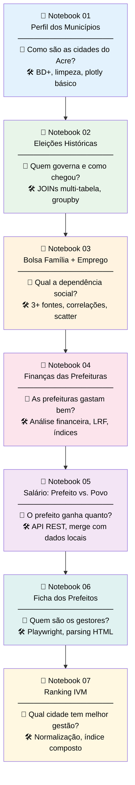
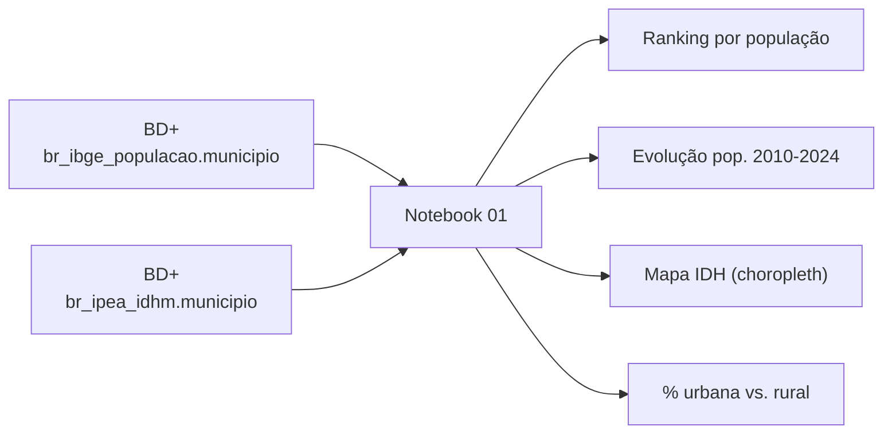
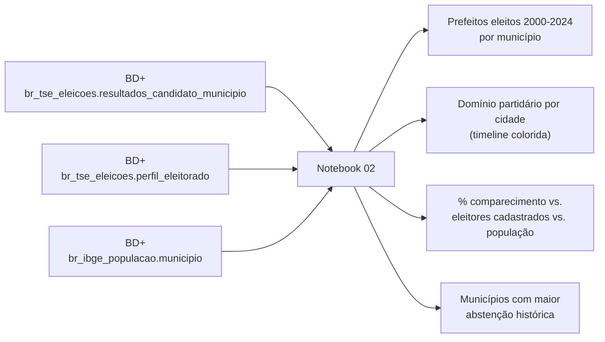
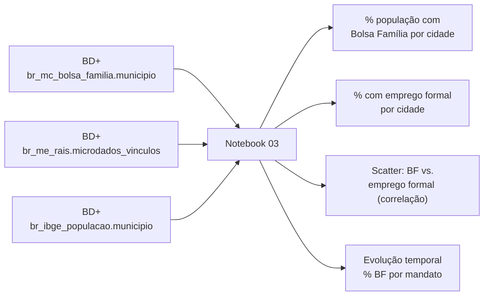
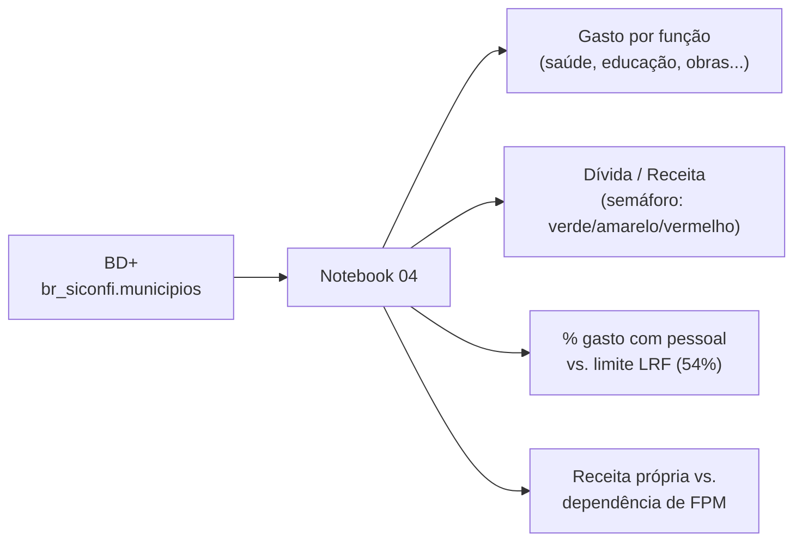
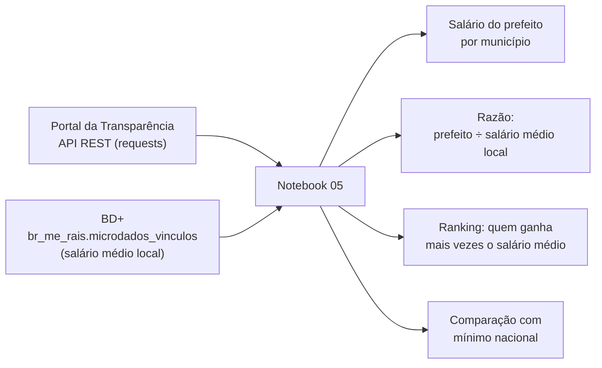
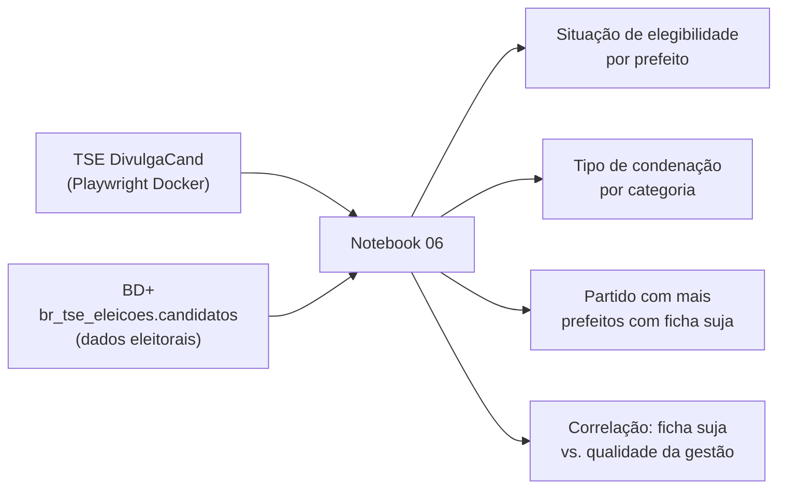
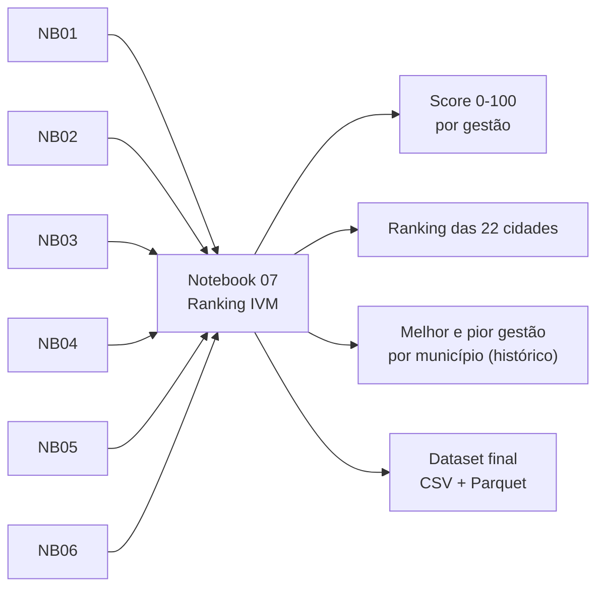
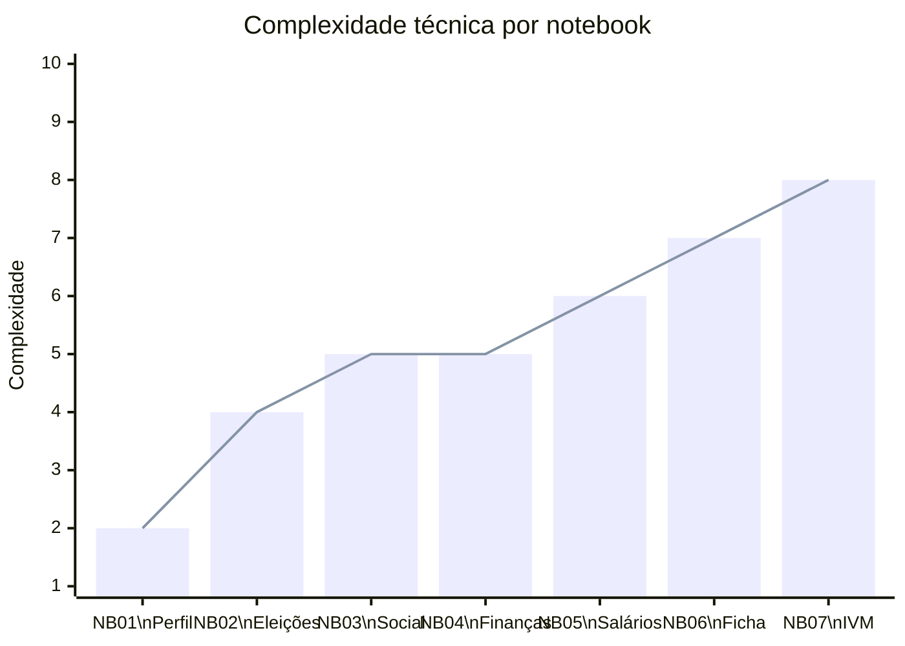

# Guia dos Notebooks — Progressão de Aprendizado

> Os 7 notebooks da Fase 1 formam uma jornada de aprendizado progressiva.
> Cada um tem uma pergunta de negócio para responder e uma técnica nova para aprender.

---

## Mapa da Progressão



---

## Notebook 01 — Perfil dos Municípios do Acre

**Pergunta:** Como são os municípios do Acre? Tamanho, IDH, população, distribuição.

**Fontes:**


**Técnicas introduzidas:**
- `bd.read_sql()` — primeira query no BigQuery
- `df.head()`, `df.describe()`, `df.info()` — exploração inicial
- `plotly.express.choropleth()` — mapa colorido por indicador
- Merge com GeoJSON do IBGE para visualizar no mapa

---

## Notebook 02 — Eleições Históricas

**Pergunta:** Quem governa cada cidade do Acre desde 2000? Qual partido domina cada município?

**Fontes:**


**Técnicas introduzidas:**
- `df.merge()` com múltiplas tabelas pela chave `id_municipio`
- `df.groupby().agg()` — agregações por município e ano
- `pd.pivot_table()` — tabela dinâmica partidos × anos
- `plotly.express.timeline()` — visualização de mandatos no tempo

---

## Notebook 03 — Bolsa Família + Emprego

**Pergunta:** Qual a dependência social de cada cidade? Existe correlação com emprego formal?

**Fontes:**


**Técnicas introduzidas:**
- Cruzamento de 3 fontes pelo mesmo `id_municipio`
- Cálculo de percentuais: `(beneficiados / populacao) * 100`
- `df.corr()` — matriz de correlação entre variáveis
- `plotly.express.scatter()` com tamanho de ponto = população

---

## Notebook 04 — Finanças das Prefeituras

**Pergunta:** As prefeituras do Acre cumprem a Lei de Responsabilidade Fiscal? Quem está endividado?

**Fontes:**


**Técnicas introduzidas:**
- Cálculo de índices financeiros (ratios)
- `pd.cut()` — categorização em faixas (verde/amarelo/vermelho)
- `plotly.express.bar()` empilhado por função de gasto
- Comparação com benchmarks legais (LRF)

---

## Notebook 05 — Salário: Prefeito vs. Povo

**Pergunta:** O prefeito de cada cidade ganha quanto comparado ao salário médio da população?

**Fontes:**


**Técnicas introduzidas:**
- `requests.get()` com autenticação por header
- Cache manual: salvar resultado da API em JSON local
- `df.merge()` combinando API + BD+
- Formatação monetária: `df["salario"].map("R$ {:,.0f}".format)`

---

## Notebook 06 — Ficha dos Prefeitos

**Pergunta:** Os prefeitos eleitos têm ficha limpa? Houve condenações durante o mandato?

**Fontes:**


**Técnicas introduzidas:**
- Playwright: `browser.new_page()`, `page.goto()`, `page.inner_text()`
- Parsing de HTML com `page.query_selector_all()`
- Enriquecimento de dataset: merge de Playwright + BD+
- `df.value_counts()` para análise de categorias

---

## Notebook 07 — Ranking IVM

**Pergunta:** Qual o ranking final de viabilidade municipal do Acre?

**Fontes:**


**Técnicas introduzidas:**
- `sklearn.preprocessing.MinMaxScaler` — normalização 0–1
- Construção de índice composto com pesos
- `df.rank()` — ranking por coluna
- `plotly.express.bar()` horizontal com cores por score
- `df.to_parquet()` — exportar para formato colunar

---

## Progressão de Complexidade



---

## Como Rodar Todos os Notebooks

```bash
# Instalar dependências
pip install basedosdados pandas jupyter plotly scikit-learn playwright
playwright install chromium

# Rodar todos em sequência (gera outputs HTML)
jupyter nbconvert --to notebook --execute notebooks/fase1_acre/*.ipynb

# Ou abrir interativamente
jupyter lab notebooks/fase1_acre/
```
