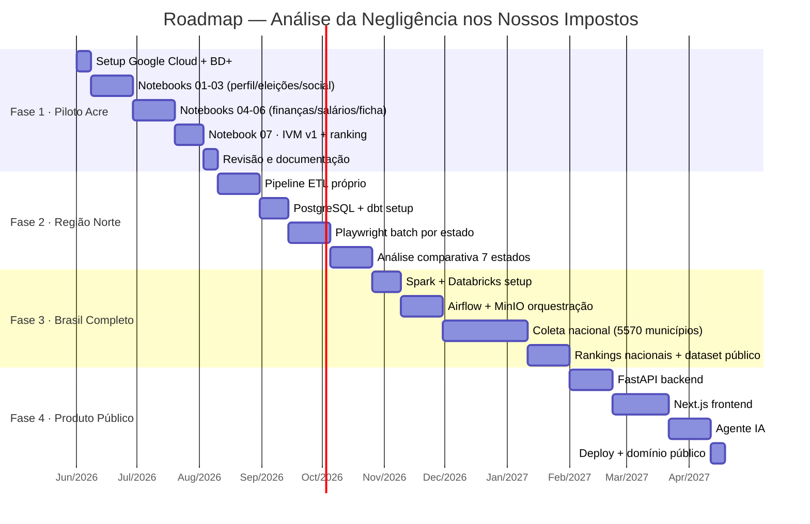
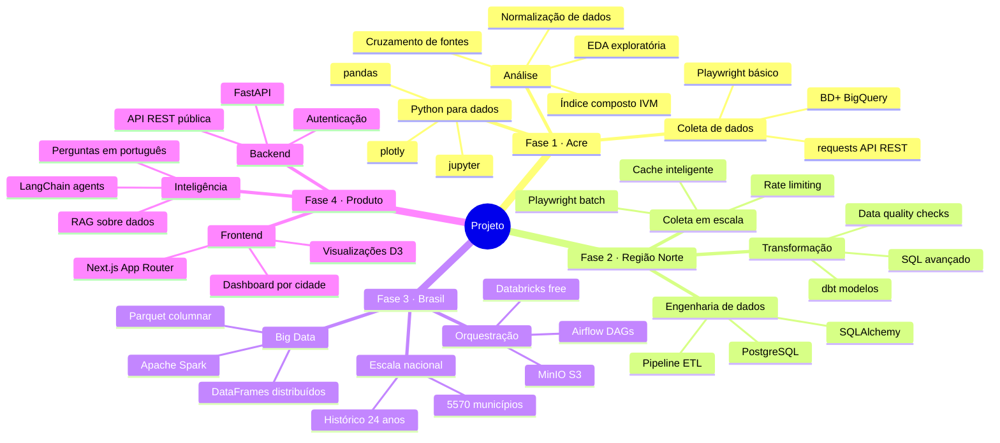
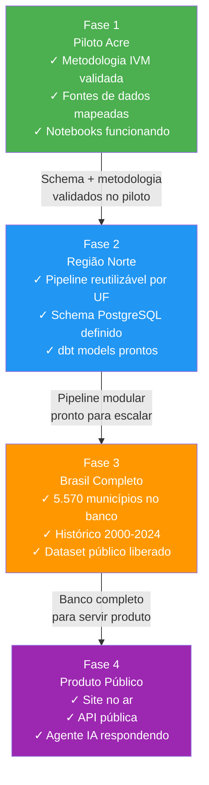

# Roadmap de Fases — Progressão do Projeto

> Cada fase tem um objetivo de aprendizado principal, além dos entregáveis de dados.

---

## Linha do Tempo

---

## O que Cada Fase Ensina

---

## Dependências Entre Fases

---

## Critérios de Conclusão por Fase

### Fase 1 — Pronto quando:
- [ ] 7 notebooks executam sem erros (`jupyter nbconvert --execute`)
- [ ] IVM calculado para 22 municípios do Acre com score 0–100
- [ ] Pelo menos 1 insight surpresa documentado por notebook
- [ ] Dataset exportado em CSV + Parquet
- [ ] Metodologia do IVM documentada e revisada

### Fase 2 — Pronto quando:
- [ ] Pipeline coleta dados dos 7 estados do Norte automaticamente
- [ ] PostgreSQL rodando em Docker com schema normalizado
- [ ] dbt models passando em `dbt test`
- [ ] Ranking regional dos 7 estados publicado

### Fase 3 — Pronto quando:
- [ ] Todos os 5.570 municípios no banco
- [ ] Histórico completo 2000–2024
- [ ] Dataset público no Kaggle ou HuggingFace
- [ ] Pipeline roda em menos de 24h para atualização completa

### Fase 4 — Pronto quando:
- [ ] Site público acessível com domínio próprio
- [ ] API REST documentada no Swagger
- [ ] Agente responde 10 perguntas-teste corretamente
- [ ] Tempo de resposta < 2s para busca por município
